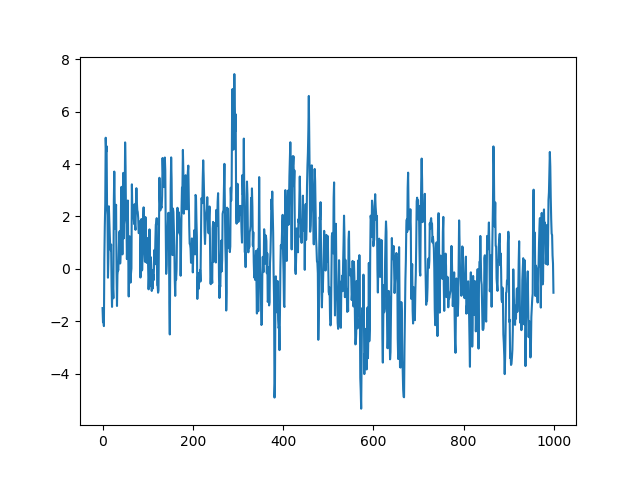
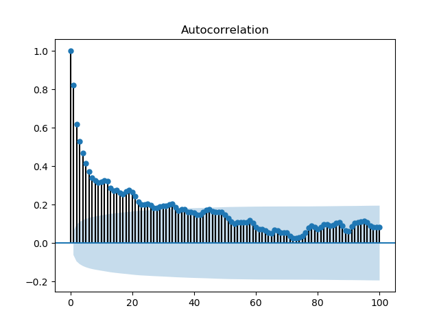

# ARFIMA simulation
Python implementation of ARFIMA(p,d,q) simulation. Generalizes to ARMA(p,q) when d = 0, and ARIMA(p,d,q) when d = 1.

User provides an array of coefficients for the AR(p) and MA(q) portions of the series as well as the fractional differencing parameter and the required length. A constant may optionally be specified, as well as the standard deviation of the Gaussian innovations, and the number of seasoning samples to be generated before recording the series.

ARFIMA models with 0 < d < 1 are long-memory processes with autocorrelation functions showing hyberbolic decay as opposed to short-memory ARMA processes with autocorrelation functions that decay at a geometric rate. An example ARFIMA() process is shown below, with **Figure 1** showing a plot of the series and **Figure 2** showing the ACF plot.

**Figure 1 - ARFIMA() series** \

**Figure 2 - ARFIMA() autocorrelation function** \

## Parameters
p_coeffs : array_like \
&nbsp;&nbsp;&nbsp;&nbsp;AR(p) coefficients, where len(p_coeffs) <= 10 \
q_coeffs : array_like \
&nbsp;&nbsp;&nbsp;&nbsp;MA(q) coefficients, where len(q_coeffs) <= 10 \
d : float \
&nbsp;&nbsp;&nbsp;&nbsp;fractional differencing parameter, where -1 < d <= 1 \
slen : int \
&nbsp;&nbsp;&nbsp;&nbsp;number of samples in output ARFIMA series, where \
&nbsp;&nbsp;&nbsp;&nbsp;&nbsp;&nbsp;10 <= len(series) <= 100000 \
alpha : float \
&nbsp;&nbsp;&nbsp;&nbsp;series constant (default=0) \
sigma : float \
&nbsp;&nbsp;&nbsp;&nbsp;standard deviation of innovations \
numseas : int \
&nbsp;&nbsp;&nbsp;&nbsp;number of seasoning samples (default=100), where \
&nbsp;&nbsp;&nbsp;&nbsp;&nbsp;&nbsp;0 <= num(seasoning) <= 10000

## Returns
series : 1d array \
&nbsp;&nbsp;&nbsp;&nbsp;random ARFIMA(p,d,q) series of specified length

## Notes
MA(q) parameters follow the Box-Jenkins convention which uses a difference representation for the MA(q) process which is the opposite of the standard ARIMA MA(q) summation representation. This matches the operation of SAS/farmasim and R/arfimasim. As such, the SAS/farmafit and R/arfima MA(q) estimates match the sign of the specified MA(q) parameters while the statsmodels ARIMA().fit() estimates have opposite the specified MA(q) parameter signs.

## References
SAS Institute Inc (2013). SAS/IML User's Guide. Cary, NC: SAS Institute Inc.

Veenstra, J.Q. (2012). Persistence and Anti-persistence: Theory and Software (Doctoral Dissertation). Western University, Ontario, Canada.

## Requirements
Python 3.6 \
Numpy 1.13.1 \
Statsmodels 0.9.0 \
Pandas 0.20.3

## Running
There are no parameters. The program is set up to access test files in the .\results directory. This path can be modified in the source file.

## Additional Info
Please see comments in the source file for additional info including referenced output for the test file.
